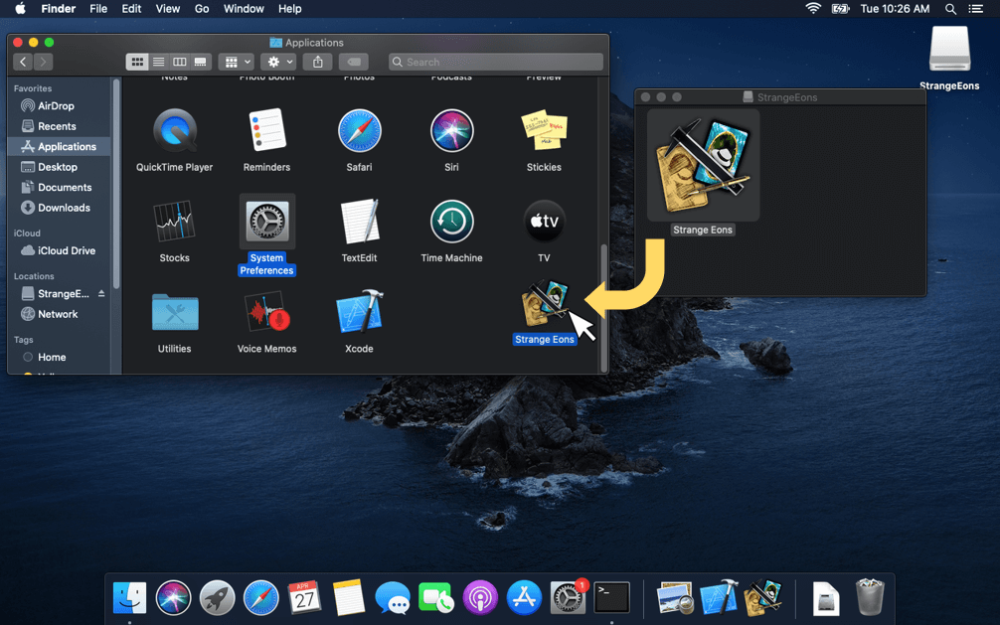
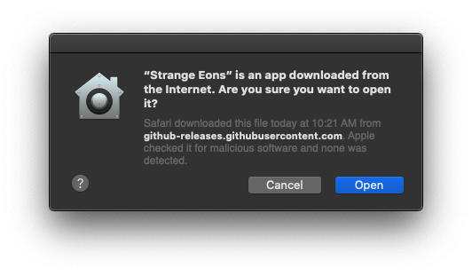
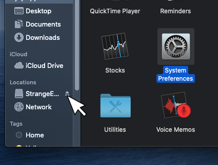

# Installation on macOS

This page describes the steps needed to install Strange Eons on macOS PCs.

## System requirements

Mac running Mac OS X 10.8.3+ or 10.9+.

At least 2 GB of RAM recommended.

## Installation steps

1. [Download the macOS disk image](http://cgjennings.ca/eons/download/update.html?platform=osx) (DMG) file. You may be asked if you want to allow downloads on "github.com." Choose **Allow**.
2. Open the downloads stack on the dock, then click the downloaded file to mount the disk image. In a few moments, a Finder window will open showing the contents, the Strange Eons app.
3. Open a new **Finder** window and choose **Applications** from the **Favorites** list.
4. Drag and drop (or copy and paste) the Strange Eons app into your **Applications** folder. If upgrading a previous version, choose **Replace** when prompted.

    

5. Wait for the file to copy, then double click the app in your **Applications** folder to start it. The first time, you start it, you will see a message that the app is being *verified*.

6. Since the app was downloaded from the Internet outside of the app store, your Mac will double check that you meant to run it. Choose **Open**.

    > **Important note about alpha and beta releases:** Alpha and beta releases of Strange Eons may not be *notarized* or *signed*. Notarization involves an additional step in which an app is submitted to Apple for their inspection. Installing an app that isn’t notarized involves some additional steps, for security reasons. If you see a message that “Apple cannot check it for malicious software”, [see the next section below for details.](#installing-unnotarized-alpha-and-beta-releases)

    

7. After the file has been copied, you can eject the mounted DMG volume.

    

## Installing unnotarized alpha and beta releases

As mentioned in the note above, alpha and beta releases may not be notarized or signed. These steps should walk you through installing them:

1. If trying to open Strange Eons shows a warning that “Apple cannot check it for malicious software”, choose **OK**. Then:
2. Open **System Preferences/Security & Privacy**.
3. If a the padlock in the bottom left is locked (closed), choose it and authenticate your identity to unlock it.
4. Next to the message about Strange Eons being blocked, choose **Open Anyway**.
5. Close **System Preferences**.
6. Open Strange Eons. A final warning may appear. Choose **Open**.
7. These steps are only required the first time you try to open the app. From now on it will be trusted.

## Troubleshooting

Installation problems are rare but frustrating. If the installer fails to start or reports a corrupt file, it usually means that the file did not download correctly. Try downloading it again. If it fails again, it may be corrupt on the server: [please report the issue](https://cgjennings.ca/contact.html).

For other issues, refer to the [Troubleshooting](um-install-troubleshooting.md) page.
