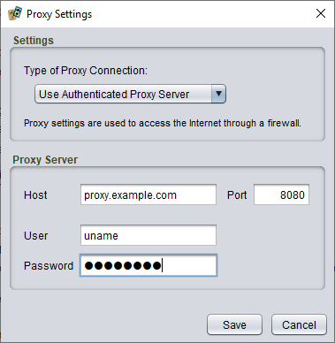
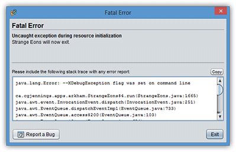

# Troubleshooting

## Catalogue download issues

Most problems related to downloading the [plug-in catalogue](um-plugins-catalogue.md) or plug-ins the catalogue are due to temporary network issues. If you have persistent problems while downloading a particular plug-in, [report it here](https://cgjennings.ca/contact.html). Problems with the plug-in itself are best reported to the plug-in author directly.

### Proxy settings

If you have persistent problems trying to download the plug-in catalogue itself (or you cannot download *any* plug-in), the problem may be related to the use of a *proxy* to access the Web. This is more likely if you are accessing the Web through a large organization such as a university.

*To configure Strange Eons to access the catalogue through a proxy,* [open the **Preferences** dialog](um-ui=preferences.md), choose the **Plug-ins** category, and under **Catalogue**, choose the **Proxy Settings** button. There are four types of proxy connection to choose from: *None*, *Use System Settings*, *Use Proxy Server*, and *Use Authenticated Proxy Server*. The default is *Use System Settings*, which attempts to use settings from your operating system. The *None* option disables the use of a proxy server and attempts to access the Internet directly. The other two options both allow you to configure your proxy settings directly in Strange Eons. The only difference is that the *Authenticated* connection must be used if your proxy connection requires a user name and password.



If you are not sure whether you access the Internet through a proxy or what your proxy settings are, consult the intranet of your institution or ask a systems administrator.

## Text quality issues

Text appears smoother when drawn with a technique called [*anti-aliasing*](https://en.wikipedia.org/wiki/Spatial_anti-aliasing). Strange Eons normally tries to use the text anti-aliasing settings of your operating system. However, this is not always reliable on Linux devices, so by default Strange Eons will instead guess and that it can use a particular kind of [*subpixel antialiasing*](https://en.wikipedia.org/wiki/Subpixel_rendering). This works well on most modern LCD panels, but you can specify a different method using the command line argument `--xAAText` with one of the following values:

| Option                                         | Effect                                                       |
| ---------------------------------------------- | ------------------------------------------------------------ |
| `auto`                                         | Use value read from system settings, if possible. *This is the default on Windows and macOS.* |
| `off`                                          | Disable all text antialiasing.                               |
| `on`                                           | Use greyscale (opacity) antialiasing.                        |
| `gasp`                                         | Use greyscale (opacity) antialiasing as specified by each font (using each the font's GASP table, if any). |
| `lcd`                                          | Use the most common LCD subpixel antialiasing (`lcd_hrgb`). *This is the default on Linux.* |
| `lcd_hrgb`, `lcd_hbgr`, `lcd_vrgb`, `lcd_vbgr` | Use the specified type of LCD subpixel antialiasing. Correct subpixel antialiasing depends on the precise arrangement of the red, green, and blue light sources that make up each pixel. The default works for most displays, but if your display uses a different arrangement you can select it with these options. |

## Other graphics issues

Some Windows devices have weird graphics glitches when running Strange Eons, such as bits of the interface not being drawn or being drawn in the wrong place. If this happens to you, try these steps:

1. Update your graphics driver to the latest version. Once installed and the the computer reboots, try starting Strange Eons again.
2. If your computer has two graphics chipsets (one power saving and one high performance), try using Strange Eons with each in turn.
3. Right click on the shortcut icon that you use to start Strange Eons and choose **Properties**. Look for the field labelled **Target**. In this field you will find something like `"C:\Program Files\Strange Eons\bin\strangeeons.exe"`. Edit this by adding a space, then the following (all *after* the `.exe"`):
   `-J-Dsun.java2d.ddoffscreen=false`
   Click **OK** and try running the app again.
4. The option above usually does the trick, but if that doesn't work, you can also try adding the following in various combinations to see if you can find one that works (put a space between each extra option, as well as between the options and the end of the `.exe"` bit):
   `-J-Dsun.java2d.opengl=true`
   `-J-Dsun.java2d.d3d=false`

## Error messages

### Not enough memory to complete the operation

This message indicates that Strange Eons is running out of memory. Memory is the temporary workspace that holds both the application and the data that the application works on, like the portrait images you load and the cards you create. When Strange Eons starts, a fixed limit is selected for the amount of memory it is allowed to use. This default limit depends on your platform.

When this message appears, you have two options: either use less memory at a time, or increase the maximum amount of memory allowed to Strange Eons. To use less memory at a time, close tabs that you do not need to have open. For example, if you are laying out a deck, just have the deck tab open and close any other files you are working on. You can also uninstall unused plug-ins, although most plug-ins don’t use much memory unless you are actually using their features. You may find it useful to install the **Developer Tools** plug-in (`eonscat:6574`) and then use the **Window/Memory Use** menu item. This will show you how much memory is being used at any given time so you can get a better idea of what is causing the problem.

#### Increasing the memory limit

If you continue to run into this message, you will need to increase the memory available to Strange Eons by modifying the [Strange Eons VM options](um-install-command-line-options.md). Here are some example settings:

`-Xmx1024m`
Sets a 1024 MiB (megabyte) limit, also known as 1 GiB (gigabyte). This is *lowest recommended value* for running Strange Eons.

`-Xmx1200m`
Sets a 1200 MiB limit, or roughly 1.2 GiB. This is about the highest setting you can safely use on 32-bit Windows; the app may fail to start without an error message if a higher value is specified.

`-Xmx2048m`
Sets a 2 GiB limit (as 2048 MiB). This is usually plenty.

`-Xmx2g`
This also sets a 2 GiB limit.

### The plug-in bundle *X* could not be updated

This indicates that you have downloaded an update for a plug-in that required a [relaunch](um-plugins-relaunching.md), but when Strange Eons restarted it was unable to replace the old plug-in for some reason. To investigate, you'll need to check your plug-in folder. If the app finishes starting, you can do this from the [plug-in manager](um-plugins-manager.md). Otherwise, find the `plug-ins` subfolder inside your [inside your user folder](um-install-user-folder.md). You should find a file with the name indicated by the error message and the file extension `.autoupdate`. You will usually also find a file with the same name but no `.autoupdate`. For example:

```
DeveloperTools.seplugin 
DeveloperTools.seplugin.autoupdate
```

The file with the `.autoupdate` extension is the new plug-in, the one without it is the old version. For some reason (file permissions, the file is open in another app, disk error) the old file could not be deleted. Try deleting it manually, then renaming the new plug-in file to remove the `.autoupdate` extension. If the file is locked because it is in use by an application and you can't figure out which one, you can try rebooting your computer first.

## App fails to start

### After installing a plug-in

If the app won't start after installing a plug-in, it is a good bet that the problem involves that plug-in. As above, find the `plug-ins` subfolder inside your [inside your user folder](um-install-user-folder.md). Locate the just-installed plug-in(s) and delete them, then try starting the app again.

### After displaying a Fatal Error message

When this appears, SE will try to check for an updated version which might have fixed the error. If it finds an update, a link will appear at the bottom of the message dialog. Otherwise, you should choose the **Report a Bug**  button to submit a bug report, or [report it here](https://cgjennings.ca/contact.html).

