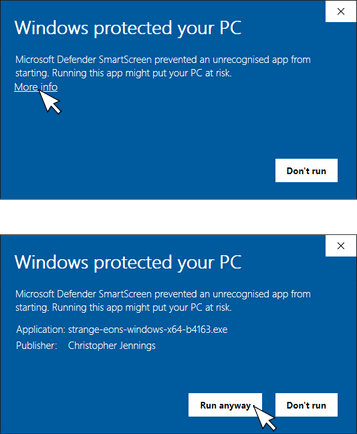

# Installation on Windows

This page describes the steps needed to install Strange Eons on Windows-based PCs.

## System requirements

* 64-bit Intel or AMD processor.
* 64-bit edition of Windows 7 SP1, Windows 8, or Windows 10.

* At least 2 GB of RAM recommended.

> **Windows ARM support?**
>
> Open Java distributions are starting to include Windows ARM 64 support. Once that support has trickled down through the tool chain used to build Strange Eons you can expect official support. In the meantime if you have installed your own ARM 64 JRE, you can try running Strange Eons using the instructions for [other devices](um-install-other.md).

Before installing, it is a good idea to check that you have the latest graphics drivers installed. Check the support page of the Web site for your computer or graphics card manufacturer.

## Installation steps

1. [Download the Windows installer.](http://cgjennings.ca/eons/download.html)
2.  Start the installer by double-clicking it in your downloads folder or opening it from your Web browser.
3. An installation wizard will guide you through the rest of the process. If you are not sure what to do, stick with the default options.

>  **Windows SmartScreen:** When a new update is released, Windows may warn you that the file has not been downloaded many times and may therefore be risky. To install the update:
>
> 1. Click **More info**.
> 2. Choose **Run anyway**.
>
> 

## Troubleshooting

Installation problems are rare but frustrating. If the installer fails to start or reports a corrupt file, it usually means that the file did not download correctly. Try downloading it again. If it fails again, it may be corrupt on the server: [please report the issue](<https://cgjennings.ca/contact.html> ).

For other issues, refer to the [Troubleshooting](um-install-troubleshooting.md) page.