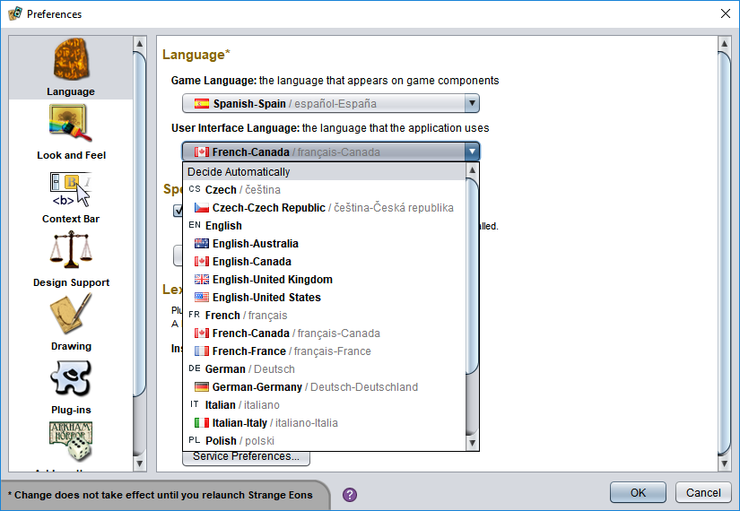

# Language settings

Strange Eons has two different language settings: one for the *interface language* and one for the *game language*. The interface language is the language used for menus, buttons, and other controls and elements in the app; the game language is used on the game components that you create. Making the game language a separate option allows you to match the language used for components to whatever edition of a game you happen to own. For example, French might be your native language, but you might want to create components for a game that is only available in German.

Normally, Strange Eons will try to use the same language used by your operating system for both the interface and game languages. If that language is not currently supported by Strange Eons, it will fall back to English. If you would prefer to use a different language, you can change the language settings manually.

## Changing the language settings

The interface and game language can be changed from [Preferences](um-preferences.md). A drop down menu for each setting lists the available languages. Simply choose the desired language and then choose OK to close the dialog. Changing languages requires a restart of the application.

## Contributing

Not all languages are supported by Strange Eons, and some of the existing translations are from older versions and are now out of date and incomplete. The available translations rely on the work of volunteers. If you would like to contribute to the translation process, have a look at the [Translation Manual](tm-index.md).