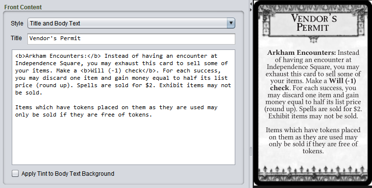
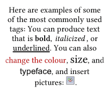

# Markup text

Most text blocks on components can be formatted using *markup tags*. If you are familiar with HTML tags, the the tags in Strange Eons will be familiar. If not, don't worry, it is easy to learn.

To *insert a markup tag*, write the tag name between angle brackets (a less than and greater than symbol), like this: `<tagname>`.

Most tags are written in pairs that surround a block of text, one to open a style and one to close it. The effect of the tag applies to all of text between the open and close tags.

To *close a markup tag*, write the tag with a `/` before the tag name, like this: `</tagname>`.

Notice how in the illustration below, the text between `<b>` and`</b>` is shown in **bold**:



## Common tags

{: .float-right}

```
Here are examples of some of the most commonly used tags:
You can produce text that is <b>bold</b>, <i>italicized</i>,
or <u>underlined</u>. You can also <colour #bc0000>change
the colour</colour>, <size 11>size</size>, and
<family "Sans Serif">typeface</family>, and insert pictures:
<image "d:\my pictures\example.png">.
```

Common shortcuts that you may be familiar with, such as using <kbd>Ctrl</kbd> + <kbd>B</kbd> to bold the selected text will work as expected. Check the **Markup** menu. You can also format markup text using the [context bar](um-context-bar.md).

To *typeset a heading, title or rule name* where relevant, surround the heading in `<h1>Rule name</h1>`.

To *typeset a subheading, subtitle or secondary rule name* where relevant, surround the heading in `<h2>Minor rule</h2>`.

## Tags with parameters

Some tags accept *parameters*, extra information that alters the behaviour of the tag. You can see several in the above examples: the `<colour>`, `<family>`, `<size>` and `<image>` tags all include parameters.

## Tag reference

### Typeface styles

`<b>`**bold text**`</b>` 

`<i>`*italic text*`</i>`

`<u>`<u>underlined text</u>`</u>`

`<del>`~~deleted text~~`</del>`

`<sup>`^superscript text^`</sup>`

`<sub>`~subscript text~`</sub>`