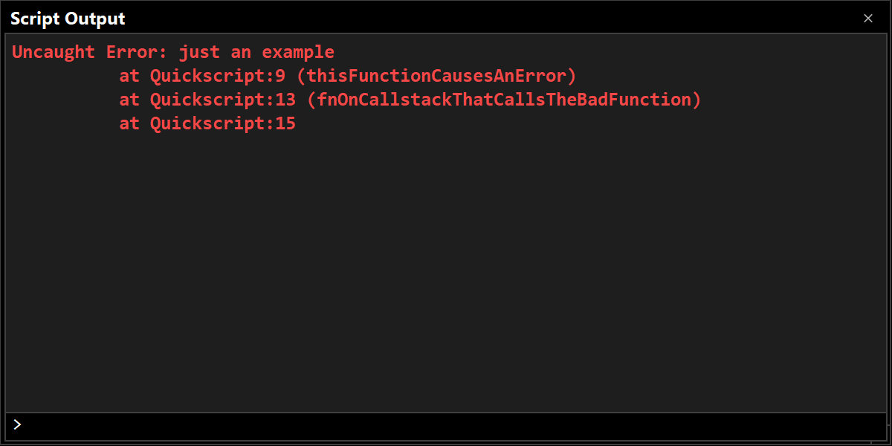

# Troubleshooting

## Investigating and reporting other errors

### Bug reports

Bugs can be reported using **Help/Report a Bug** from the application, or by [creating an issue on GitHub](https://github.com/CGJennings/strange-eons/issues). Actionable bug reports include the following:

1. A clear and descriptive title or summary.
2. Relevant contextual information about your environment (e.g., Strange Eons version, operating system, total system RAM).
3. Steps to take to reproduce the bug. If I can’t make a bug happen, I can’t reliably fix it.
4. Additional information or suggestions. Include any relevant error messages, log entries, or stack traces (see below). Include anything you tried to do to solve the problem and what happened. Include other information that you think might be relevant.

> **Tip:** If the report is large or requires additional data (such as an `.eon` file needed to reproduce the problem), a GitHub issue is probably your best bet as you can attach files to it.

### Is the problem due to a plug-in?

Before sending a bug report about Strange Eons, it helps if you can narrow down whether or not the problem is due to a plug-in. If a plug-in is the source of a bug, you may need to report it to the plug-in developer to get it resolved. It is not always obvious whether an issue was caused by a plug-in. Because plug-ins can “hook into” different parts of Strange Eons, they can cause problems without being explicitly activated. Here are some things to consider:

* Did you recently install a plug-in? Does the error go away if you try uninstalling that plug-in (or those plug-ins)?

* Is a script error message displayed in the script output window? Here is an example of what that can look like:

  

If an error appears to be due to a plug-in, check the plug-in catalogue for contact information in order to report the error.

### Is there an obvious error message?

Does the application display an obvious error message, or does it just seem to fail silently? If there is an error message, be sure to include it in any report.

### Is there a stack trace or log entry?

If you start the app from the command line, stack traces and log entries may be printed there. You can copy and paste them in your error report.

You can also view the application log from within Strange Eons. Open the Script Output window if it is not already visible (**Window/Script Output**). Right click in the window and choose the option to print the application log.

Log entries start with a date and time in square brackets, followed by a location, followed by a message that starts with the “log level” followed by one or more lines of log message. Here is a “normal” example:

```
[Feb. 26, 2024 12:20:10 a.m.] ca.cgjennings.apps.arkham.plugins.BundleInstaller loadExtensionBundles
  INFO: starting extension script:res://log1/servitors.js [priority=500]
  INFO: starting extension script:res://PlEx/LRL-V.js [priority=500]
  INFO: starting extension script:res://PlEx/LRL-P.js [priority=500]
  INFO: starting extension script:res://PlEx/LRL-E.js [priority=500]
  INFO: starting extension script:res://PlEx/LRL-A.js [priority=500]
  INFO: starting extension script:res://cgjls/large-scen.js [priority=500]
```

These entries were all created in `loadExtensionBundles` (part of `ca.cgjennings.apps.arkham.plugins.BundleInstaller`) around the same time. They all have log level `INFO`, which means that they are providing information rather than reporting problems. Generally, `INFO` entries do not include essential information for tracking a bug, although they can provide useful context about what was happening at the time.

Log entries that indicate problems would usually be marked with a level of `WARNING` or `SEVERE`. Here is an example of a “severe” problem was being logged, including a *stack trace* for an *exception* that led to the problem:

```
[Feb. 26, 2024 1:05:39 a.m.] ca.cgjennings.AbstractUtilityParser parse
  SEVERE: unexpected parser exception
java.lang.IllegalStateException: FAILED ASSERTION
	at ca.cgjennings.AbstractUtilityParser.parse(AbstractUtilityParser.java:61)
	at ca.cgjennings.SyntaxChecker.parse(SyntaxChecker.java:65)
	at ca.cgjennings.ScriptCodeSupport$SRParser.parse(ScriptCodeSupport.java:70)
	at org.fife.ui.rsyntaxtextarea.ParserManager.actionPerformed(ParserManager.java:163)
	at java.desktop/javax.swing.Timer.fireActionPerformed(Timer.java:317)
	at java.desktop/javax.swing.Timer$DoPostEvent.run(Timer.java:249)
	at java.desktop/java.awt.event.InvocationEvent.dispatch(InvocationEvent.java:313)
	at java.desktop/java.awt.EventQueue.dispatchEventImpl(EventQueue.java:770)
	at java.desktop/java.awt.EventQueue$4.run(EventQueue.java:721)
	at java.desktop/java.awt.EventQueue$4.run(EventQueue.java:715)
	at java.base/java.security.AccessController.doPrivileged(Native Method)
	at java.desktop/java.awt.EventQueue.dispatchEvent(EventQueue.java:740)
    ...
```

Stack traces like the above help to pinpoint exactly where an error is occurs. Whenever possible, include this information with any bug report.

> **Tip:** When the application log is printed in the script output window, informational messages will be blue, warnings will be yellow, and severe entries will be red.

## Resolving issues yourself

Developers are, of course, welcome and encouraged to submit fixes for bugs that they uncover.

To resolve script-based bugs, you can use the built-in Strange Eons [script debugging client](dm-debugger.md). Report script fixes to the relevant plug-in author. To implement the fix locally, create a project, copy the buggy plug-in bundle into it, and choose **Import plug-in** to unpack it for editing.

To resolve app issues, see the build instructions and related information in the Strange Eons repository [README](https://github.com/CGJennings/strange-eons). To submit a fix, [fork the Strange Eons repository](https://docs.github.com/en/pull-requests/collaborating-with-pull-requests/working-with-forks/fork-a-repo), [create a branch with the needed changes](https://docs.github.com/en/pull-requests/collaborating-with-pull-requests/proposing-changes-to-your-work-with-pull-requests/creating-and-deleting-branches-within-your-repository), and finally [submit a *pull request* for that branch](https://docs.github.com/en/pull-requests/collaborating-with-pull-requests/proposing-changes-to-your-work-with-pull-requests/creating-a-pull-request).