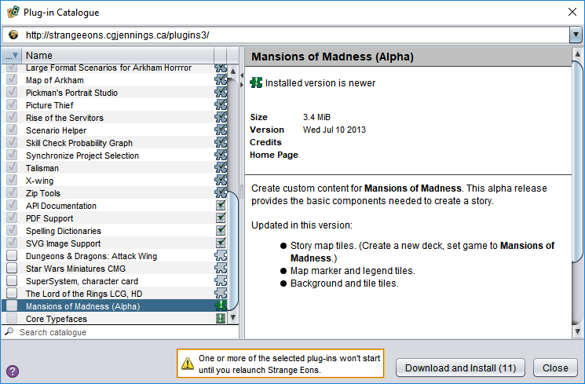

# The plug-in catalogue

The plug-in catalogue, available from the **Toolbox/Catalogue** menu, is used to install and update plug-ins. When the opened, it connects to the Strange Eons Web site and downloads the latest catalogue. You can then browse the available entries and choose which plug-ins to install. Clicking a listing displays more information about it, and choosing **Download and Install** will install your selections. Some plug-ins include *installation notes*, which are displayed in a pop-up window during installation. After reading the notes, click **Close** to dismiss the window.

## Listing icons

The catalogue uses the following icons to help you identify the status of each plug-in:

|                  Plug‑in Icon                  |         [Core](um-core-components.md) icon          | Description                                                  |
| :--------------------------------------------: | :-------------------------------------------------: | ------------------------------------------------------------ |
|   |   | **New:** not installed, and new or updated since you last checked the catalogue |
|       |       | **Not installed:** not installed, not new                    |
|    |    | **Update available:** a new version of this installed plug-in is available |
|          |          | **Up to date:** the latest version is installed              |
|  |  | **Future version:** the installed version is newer than the one in the catalogue (may be seen by plug-in developers, or if the catalogue information is wrong) |
|          |               | **Update required:** the app must be updated before this plug-in can be used |

## Filtering (searching) the listings

You can enter search terms in the field below the listings to filter what is displayed. The terms you enter will be matched against the name, description, credits, catalogue ID, and other fields. Only listings that match will be shown. To show all listings again, delete the text in the filter field.

A number of useful built-in filters are provided, such as filtering by game or plug-in type. You can access these by right clicking the filter field.

### Advanced filter syntax

The filter field accepts one or more *search tokens*. Search tokens are separated from each other by commas and/or spaces. (When making an [`eonscat` link](um-eonscat-links.md), avoid using spaces.) A token is normally matched against the `name`, `description`, `credits`, `tags`, `core`, `id`, and `comment` keys in the [catalog listing data](dm-eons-plugin.md) assigned by the plug-in developer. To match against a specific key, start the search token with the key name and an equals sign. For example, the token `game=AH` matches the `game` key against the token `AH`. If a token starts with an exclamation mark, as in `!game=AH`, then it will *exclude* matching plug-ins from the results.

Normally, a token matches the value of a key if it occurs anywhere inside it. However, when matching the `game` key, the token must match the entire value. Matching is not case-sensitive. The following wildcards are allowed in tokens: `*` to match any text except spaces, and `.` to match a single letter.

## For plug-in developers

### Submitting plug-ins

Plug-in developers can submit their own plug-ins for inclusion. At the moment, the easiest way to get started is through this [contact form](https://cgjennings.ca/contact.html). The plug-in's catalogue listing information is prepared using the [root file editor](dm-eons-plugin.md). To test how your listing will appear, you can use the catalogue tools included with the **Developer Tools** plug-in (`eonscat:39f10fa9-6574-4be1-9dd6-3e658c9a6fd3`).

### Third-party catalogues

Developers can create their own private catalogues. To display a private catalogue's listings, paste its base URL into the address bar at the top of the dialog and press <kbd>Enter</kbd>. Private catalogues can be prepared using the catalogue tools (see above).

### Clearing cached listings

The standard catalog is cached for a few hours to prevent excessive downloading. This rarely causes problems, but you can bypass the cache by clicking in the address bar and pressing <kbd>Enter</kbd>.
