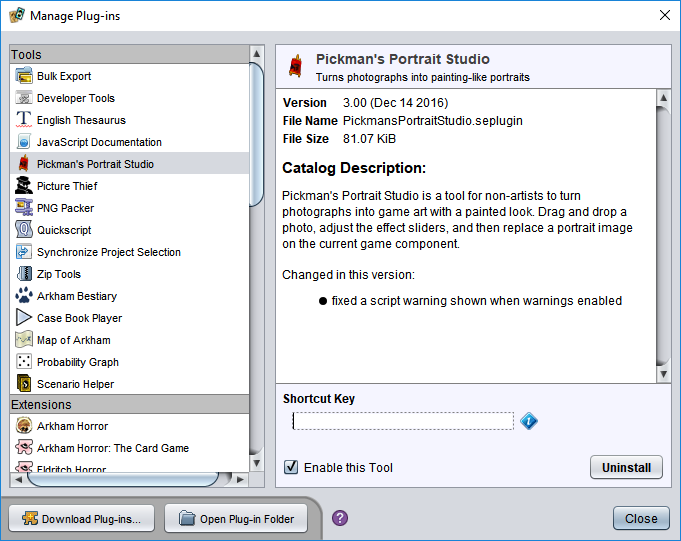

# Plug-in manager

The plug-in manager lets you view, uninstall and configure some basic settings for installed plug-ins. It can be opened with the **Toolbox/Manage Plug-ins** menu item. This opens the management dialog, which lists installed plug-ins on one side and shows details of the selected plug-in on the other.

## Uninstalling a plug-in

To uninstall a plug-in, select it in the list and click the **Uninstall** button. [Relaunching](um-relaunching.md) the app may be required to complete the request.

## Options for "tool" plug-ins

Some plug-ins install themselves as tools that are listed in the **Toolbox** menu. Tools have a few additional configuration options not available to other plug-ins. You can assign a shortcut key to activate them: click in the **Shortcut Key** field, then press the desired key combination. (To clear a shortcut, press <key>Backspace</key> or <key>Delete</key>.) You can also enable or disable them without uninstalling in order to keep the number of entries in the **Toolbox** menu manageable.

## Opening the plug-in folder

It is occasionally useful to display the folder that contains the installed plug-in files. Clicking **Open Plug-in Folder** displays this folder in your desktop file manager (Explorer in Windows or Finder in macOS).