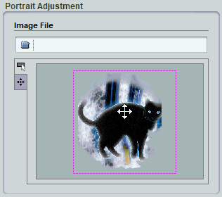
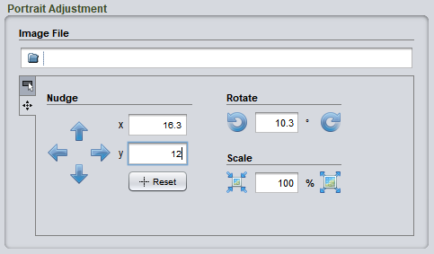

# Portraits

A portrait is a graphic that you add to a component as an illustration. A character card might include a picture of the character in profile, an item card may include an illustration of the item, and so on. Portraits are edited using a standard control called a portrait panel.

To *change the image on a portrait*, click the folder icon or drag and drop a new image on the panel. The initial position and size will be set automatically, but you can make further adjustments if desired.

To *return to the default image*, click in the **Image File** field, erase the text, and press <kbd>Enter</kbd>.

To *resize the image*, drag on one of the corners of the dotted purple frame.

To *pan the image within the portrait space*, drag inside of the frame.

To *rotate the image*, drag the handle in the center of the frame. Not all portraits support rotation, so this control may not be present.

When you first choose a portrait image, the center of the image will be aligned to the center of the portrait area on the component. This may not be the most interesting part of the image, so you may want to move the portrait around. However, the scale is usually set to just fit the image in the portrait area, so if you move the image without resizing it, the portrait may not cover the entire portrait area. This will expose a blank area behind the portrait. To correct this, you first need to scale the portrait image up a bit. The closer you want to move the focus of the portrait to one of the edges or corners of the image, the more you will need to increase the scale. However, if you need to scale it up too much, you will start to see blocky artifacts. In this case, you should either choose a new image or else edit the image to extend the edges of interest.

If visually adjusting the frame does not give you enough control, click on the fine tuning tab at the left of the adjustment controls. Then click the arrow icons or enter specific numeric values.

Again, if the portrait does not allow rotation, those controls will not be visible.