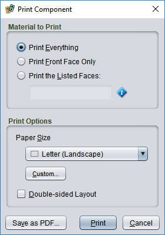

# Printing components

The **File/Print** menu is a quick way to print a single component. For more control, or to print a group of components together, you will want to create a [deck](um-deck-editor.md).

If the component has more than one face, such as a card with a front and back side, you can choose whether to print all of the faces, just the front (first) face, or a specific set of faces that you will list, such as `1, 2, 5-6`.

If you choose **Double-sided Layout**, matching front and back faces will be aligned on the front and back side of the same page. Note that most printers with a duplex feature are not precise enough for the two sides to match up exactly.

[Printing and assembling tips](um-deck-print-tips.md)

