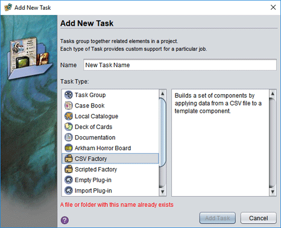

# CSV Factories

With a CSV factory, you can automatically create a deck of cards from a table like this:

| name | $gold | $agility | $strength | $wisdom | $ability |
| ---- | ----- | -------- | --------- | ------- | -------- |
| Bijou the Thief | 16 | 4 | 2 | 2 | Scales buildings in 1 turn. |
| Galrak the Mighty | 8 | 2 | 5 | 1 | Smashes through locked doors. |
| Zing the Strange | 10 | 3 | 1 | 4 | Invulnerable to negative mindsets. |

A CSV factory creates groups of game components by filling them in using data from a CSV (Comma Separated Value) file. A CSV file is a plain text file that stores tabular data (data arranged in rows and columns). You can create CSV files using a spreadsheet or any text editor. Each row creates a new card or other component; the column values for the row fill in that component's unique details.

To get started you need to install the CSV Factory plug-in from the [catalogue](um-plugins-catalogue.md):  
`eonscat:964c`

This will add a new option when adding a task to a project, the CSV Factory.



The new task folder will include the following parts:

{: .float-right}

- an `output` folder; components made by the factory will go here
- a sample `data.csv` file and `template.eon` game component
- a `make.ajs` automation script that builds a set of components from the template and CSV data
- a `readme.txt` file with a summary of these instructions

## Running the factory

Double clicking on the `make.ajs` script will clear the `output` folder of all files and then rebuild the component set. A new task starts with sample files that will create a couple of components for the Talisman game plug-in. If you want to test it out, you'll need to install that plug-in. When you are ready to start making your own components, replace `template.eon` and `data.csv`.

## The template file

The `template.eon` file should be an example of whatever kind of game component you want to create. The *content* of the template does not matter: by default the factory will clear the template (as if by using **Edit/Clear**) before starting each new component. Just create a new component of the kind you want to make, and save it overtop of the sample template file.

## The CSV file

A CSV file describes a table of rows and columns using plain text. Typically, each line in a CSV file represents one row of the table, and columns within the row are separated with a `,`. The first row of this table is special: it is a header row whose cells describe the part of the template component modified by that column. Every row after that will be used to created a game component by applying the values in that row's cells to their part of the template described by their respective columns. Here is a simple example:

```
name,$key1,$key2
Fred,value1,value2
George,value1,value2
```

This table has three rows and three columns. The first row describes what each column will change in the template: the `name`, `$key1`, and `$key2`. This will affect the component's name and two private setting keys, `key1` and `key2`.

The following rows would each lead to a new game component created from the supplied template. For the first row, the factory will set the template's name to `Fred`, its private setting `key1` to `value1`, and its private setting `key2` to `value2`. The second row will do the same, except the name will be set to `George`.

> In the example, `value1` and `value2` are repeated in the second row. The factory provides a shortcut for this: if a cell's value is exactly `"` then it will copy its value from the same column in the previous component row. (Note that due to the way CSV files work, that value has to be *escaped*, so in the actual CSV file this value appears as `""""`. As long as you use a program such as a spreadsheet to edit the file, you won't need to worry about the gory details of the CSV file format.)

Empty rows have no effect on the factory and are simply skipped.

### Column names

By default, the following rules are used to figure out how a component should be modified based on a column's name:

1. The special name `file` sets the save file to use for this component in the `output` folder. You can skip the `.eon` extension. If you don't supply this column, the components will be named `1.eon`, `2.eon`, and so on.

2. Names that start with a `$` will affect the private setting with that name. For example, the name `$title` would cause that column to change the component's `title` private setting. The **Setting Explorer** is helpful for determining which setting names a component uses. This is part of the **Developer Tools** plug-in, `eonscat:39f10fa9-6574-4be1-9dd6-3e658c9a6fd3`.    

3. A column name that *starts* with `port` can affect a component's portrait. The rest of the name determines what part of the portrait the name affects:  
  
   `portSource` or `portSrc`: the source image file (a file path or URL)  
   `portScale`: the scale factor  
   `portPanX` or `portX`: the horizontal offset of the portrait from its default centered position  
   `portPanY` or `portY`: the vertical offset of the portrait from its default centered position  
   `portRotation` or `portRot`: the rotation angle, when allowed by the component type (in degrees)  
   
   If the template component has more than one portrait, add a number after the `port` to specify which one the column should affect: `port0X`, `port1X`, and so on. Components are built in column order, so a portrait's source should always be set first since this resets the other values to a default based on the image dimensions.


4. A column name not covered by any of the above is used to locate a *setter method*. For this to match, the  template class must define a method (function) whose name starts with `set` and ends with the column name. In the example above, the column `name` matched the method `setName`. (The first letter of the name will be capitalized when matching it against available setters.) For scripted components (the most common kind), `name` is probably the only column of this kind you will ever need. For compiled components, there are a few more rules to be aware of: The setter method must take exactly one parameter, and it must be a `String`, `Double`, `Float`, `Integer`, `Short`, `Byte` or `Enum` (or a comparable primitive type such as `double`). When filling out a component, it must be possible to convert the cell value to a suitable object using the matching `<Type>.valueOf` method.

5. If it can't find a way to apply the column name to the component, the default behaviour is to stop with an error. This is usually what you want, since you might have misspelled something. If these rules are not flexible enough, you can implement any strategy you want by subclassing the `CsvFactory` (see below).

## The factory script

In most cases, you can simply run the `make.ajs` script unchanged. You won't need to understand or even look at the code. When blissful ignorance fails you, read on for some pointers to get you started.

### CSV file format tweaks

There are many variants of the CSV format. Files produced by your favourite tool might not work with the factory script out of the box, but you can probably get it to work by modifying the defaults in this section of the script:

```js
// Set up the factory:
let factory = new CsvFactory();
//     separates cell values in the row (default ',')
factory.setDelimiter( ',' );
//     surrounds cell values that contain the delimiter (default '"')
factory.setQuote( '"' );
//     if true, space around delimiters is ignored (default false)
factory.setExtraSpaceIgnored( false );
```

The delimiter is the character that separates one cell from another within a row. It is usually `,` (hence, *Comma* Separated Value) but some files use Tab (`\t`) or another character.

The quote character is used to surround an entire cell value when it contains the delimiter. It is usually `"`: to store the cell value *Hey, Sarah* the file would use `"Hey, Sarah"` to keep the `,` from adding another cell. This creates its own problem if the cell contains the quote character. In this case, the cell is quoted and then anywhere the quote appears within the cell, the quote is doubled. So *The "dog" barked* becomes `"The ""dog"" barked"`.

The most common CSV formats treat spaces at the start or end of a cell value as significant, meaning they are included as part of the cell's value. If you are writing your CSV file by hand, this can make it difficult to read since `all,the,cells,must,run,together,with,no,spaces`. Setting this to `true` will let you write `more, readable, files`.

### Changing the inputs or outputs

You can change the file names used by the factory by changing the string constants near the start of the file. You can change how the input data is loaded using code near the top of script. For example, you could use the currently edited component as a template instead of reading it from a file, or download the CSV file from a URL. If you want to do something with the modified component other than save it to a file, you can override the `write(GameComponent template, String fileName, long recordNumber)` method in `CsvFactory`.

### ⚠️ Custom column handling

To change how your factory deals with a column name, you can subclass the `CsvFactory` created in the `make.ajs` script and override the `processRow` method. This method provides three parameters: the `template` to be modified, `rowValues`, which describes the current row, and `prevRowValues`, which describes the previous row. Both `rowValues` and `prevRowValues` consist of a map (technically, a `Map<String,String>`) from column names to their values in the relevant row. If you wish to process every column in order yourself, you can use `rowValues.keySet().iterator()`. Otherwise, you can handle whichever columns you want to customize yourself and then call the superclass method to use the standard handling algorithm:

```js
factory = new JavaAdapter( CsvFactory, {
  processRow: function processRow( template, rowValues, prevRowValues ) {
    // extract our special key
    let value = rowValues.get("mySpecialColumn");
    // parse value ourselves and modify template accordingly
    template.settings.set("special", "*"+value+"*")
    // call the superclass implementation to handle other column values normally
    this.super$processRow( template, rowValues, prevRowValues );
  }
});
```

By default, the factory will report an error if the default algorithm does not know what to do with a column name. You can prevent this by calling `factory.setIgnoreUnknownKeys(true)`. Alternatively, you can `remove` any columns that you handle yourself from `rowValues` before calling the superclass.

If you need to perform custom setup (or cleanup) steps, you can override `beginProcessing()` or `endProcessing()`, respectively.
