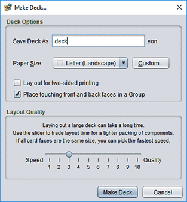
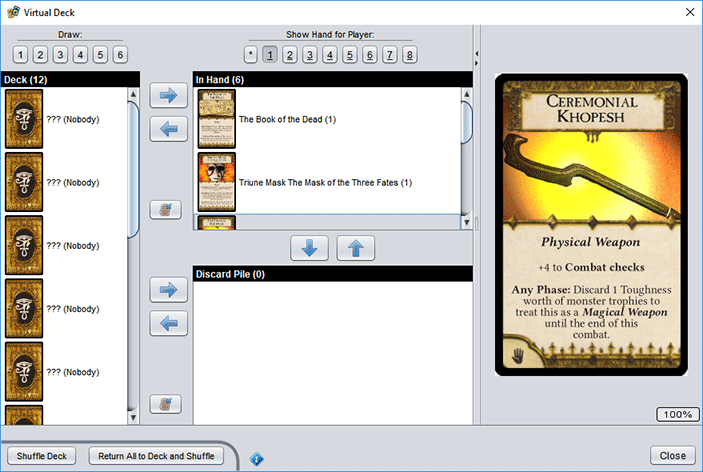

# Deck of Cards task

The **Deck of Cards** task collects a group of related game components together. This is usually a deck of cards, but you can use any components you like.

## Special task actions

### Adding components

To *add a new game component to the deck*, right click on the task folder and choose **New/Game Component**. The dialog for choosing new components will appear, but the usual **Create** button is labelled **Create in Project**. When clicked, the selected component will be created, saved in the task folder, and then you will immediately be prompted to rename the file with a name of your choice. The component will also be opened for editing.

### Making a deck automatically

To *create a deck with the task's cards laid out for you*, right click on the folder and choose **Make Deck**. In the dialog that appears, enter a file name and choose the target **Paper Size** for the deck, then click on **Make Deck**.



To *lay the cards out with front faces on one side of a page and backs on the other*, choose **Lay out for two-sided printing**. Be aware that this is probably [*not* what you want](um-deck-print-tips.md)!

To *put front and back face pairs in a selection group* in the resulting deck, check **Place touching front and back faces in a Group**. This only affects how the faces behave in the deck editor; it has not effect on how the deck is laid out or prints.

This action is effective at laying out decks: it lets you mix components of different types and sizes, it knows how to match up front and back faces, and it does a good job of minimizing the number of pages. To reduce page use more aggressively, you can drag the **Layout Quality** slider closer to **Quality**, but it will take longer to lay out the deck. (If all of the components in the deck are the same size, this won't but you anything.)

### Bulk export

This action converts a group of game components to images *en masse*. It is not actually part of the deck task, but is added by the **Bulk Export** plug-in.  
`eonscat:8f413848-961f-490d-a1ae-5aaf1cd77220`

### Testing a virtual deck without printing

To *simulate a physical deck of cards without printing them*, right click on the task folder and choose **Virtual Deck**. A dialog with several panes appears; resize it to comfortable dimensions for your cards.



On the left side is a list of cards, face down, that represents the **Deck**. Just to the right of the **Deck** are the **In Hand** cards for up to 8 players, and below that is the **Discard Pile**. To the far right is a component viewer. Whenever you select a face up card (or peek at a facedown card), the viewer will display that component so you can read the card text easily.

To *peek at a facedown card in the deck*, hold <kbd>Shift</kbd> and right click the card.

To *change which player's hand is shown*, click the button for the player number (1-8) above the **In Hand** area. There is also an extra "hand", labelled *, that you can use as a temporary workspace.

To *draw cards from the top of deck to the current player's hand*, click on one the number buttons 1-6 above the **Deck** area to draw the matching number of cards.

To *give cards from one player to another*, select the cards in the first player's hand, then right click on the **In Hand** area. Click the button of the player you wish to transfer the selected cards to.

> You can assign names to the different players. Right click on the **In Hand** area and enter names into the text field next to each player number. The name of the player that owns a card appears in brackets after the label for each card.

To *move cards from a hand or the discard pile to the bottom of the deck*, select the cards in the source list and click the  **return to deck** button.

To *move any selected cards* from any of the card lists to another list, select the cards and then click the arrow button that points from the source deck to the destination. You can also drag and drop the cards directly.

To *shuffle the cards currently in the deck*, choose **Shuffle Deck** at the bottom of the window.

To *move everything back to the deck and then shuffle it*, choose **Return All to Deck and Shuffle**.

## The `copies` file

Some decks include more than one copy of certain cards. To support this, new deck folders will include a file named `copies`. To indicate that a component is repeated in the deck, you add a line to this file that consists of the components file name (you can leave off `.eon`), an equals sign `=`, and the number of copies. For example:

```properties
# Lines that start with a # are comments and will be ignored
# The deck will include 6 water flasks, 3 ropes, 2 lanterns,
# and 1 copy of any files not specifically listed.
WaterFlask.eon = 6
Rope.eon = 3
# The .eon is optional; this is the same as Lantern.eon
Lantern = 2
```

The number of copies specified here will be used by both the **Make Deck** and **Virtual Deck** commands.

> **Tip:** An easy way to add more copies to this file is to double click it to open it, then drag and drop game components from the project pane onto the open `copies` file. An entry for the file will be added, and the number of copies selected so you can easily change it. Dragging and dropping the same file multiple times will increase the number of copies by 1 each time.