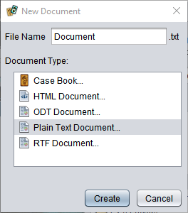

# Documentation task

The **Documentation** task lets you store documents related to your project, such as rules for a new game or expansion or notes and plans being shared between those working on the project. When you create a task of this type, you will be prompted to choose a format for the first document. The task can create empty document files in a variety of formats. The exact choices depend on which plug-ins are installed.

> If none of the offered formats is suitable, just create a plain text document, delete it, and then copy a file in whatever format you wish to the folder. (If you use this format a lot, you can always write a plug-in to add support for it.)