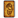
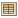

# Project file types

## Common project files
|                       Icon                       | Type                   | Extension(s)           | Notes                                                        |
| :----------------------------------------------: | ---------------------- | ---------------------- | ------------------------------------------------------------ |
|    | Game component or deck | `.eon`                 |                                                              |
|              | Copies file            | exact name `copies`    | describes the number of copies of a component to include in a deck when [making it automatically](um-proj-deck-task.md#making-a-deck-automatically) |
|                | CSV table              | `.csv`                 | source data for a [**CSV Factory**](um-proj-csv-factory.md)  |
|              | Script code            | `.js`                  | to *run the script*, right click on it and choose **Run**    |
|                  | Automation script      | `.ajs`                 | a script meant to [automate some task](um-proj-automation.md); runs when double clicked, to *edit the script*, right click on it and choose **Open** |
|                    | ZIP archive            | `.zip`                 | requires the Zip Tools plug-in `eonscat:fd53`                |
|              | Folder                 |                        | a plain (non-task) folder                                    |
|                  | Task folder            |                        | an additional graphic is overlaid on the circle to indicate the task type; this graphic can be [customized](um-proj-intro.md#basic-project-file-management) |
|        | Deck of Cards task     |                        | [collects a group of related game components](um-proj-deck-task.md) |
|          | Documentation task     |                        | [used to store rules, notes, or other documentation](um-proj-doc-task.md) |
|  | Factory task           |                        | [used to generate game components automatically from data or code](um-proj-factory-task.md) |
|    | Plug-in task           |                        | [used to develop new plug-ins](um-proj-plugin-task.md)       |
|                  | Generic task           |                        | [a general purpose task folder](um-proj-generic-task.md)     |
|      | Task group             |                        | [a task that can contain other tasks](um-proj-intro.md#adding-tasks) to group them together |
|            | Project                | folder or `.seproject` | the root folder of a [project](um-proj-intro.md); contains all other project content |

### Formatted text documents

|               Icon               | Type                      | Extension(s)                            | Notes                                                        |
| :------------------------------: | ------------------------- | --------------------------------------- | ------------------------------------------------------------ |
|    | Plain text                | `.txt`                                  |                                                              |
|  | Hypertext markup language | `.html`, `.htm`                         | to *edit*, double click to **Open**; to *view* right click and choose **Browse** |
|    | Cascading style sheet     | `.css`                                  | used by HTML files to declare how content should be presented |
|    | Miscellaneous             | `.doc`, `.docx`, `.rtf`, `.wpd`, `.odt` | recognized as documents; double click to open in default application on your system |

### Images

To *convert or optimize a bitmap image*, right click and choose **Convert To/PNG**, **Convert To/JPEG**, or **Convert To/JPEG2000**. Adjust the quality and scan settings as desired, then choose **Convert**.
|                       Icon                       | Type           | Extension(s)    | Notes                                                        |
| :----------------------------------------------: | -------------- | --------------- | ------------------------------------------------------------ |
|                | JPEG           | `.jpg`          | widely supported [lossy bitmap image format](https://cgjennings.ca/articles/jpeg-compression.html); does not support transparency |
|                | JPEG2000       | `.jp2`          | lossy or lossless bitmap format commonly used in plug-ins to retain quality and reduce size |
|                | PNG            | `.png`          | widely supported lossless bitmap image format                |
|                                                  | Windows Bitmap | `.bmp`, `.gif`  | widely supported legacy format                               |
|                                                  | GIF            | `.bmp`, `.gif`  | widely supported obsolete format                             |
|                                                  | Photoshop      | `.psd`          | to *convert to a regular bitmap image*, double click to **View** then choose **Save As** |
|  | SVG            | `.svg`, `.svgz` | requires core component; limited support, always converted to fixed bitmap internally |

## Plug-in files

### Code
|                 Icon                 | Type               | Extension(s) | Notes |
| :----------------------------------: | ------------------ | ------------ | ----- |
|  | Script source code | `.js`        |       |
|      | Java source code   | `.java`      |       |
|    | Compiled Java code | `.class`     |       |

### Data

| Icon                                         | Type                   | Extension(s)             | Notes                                              |
| -------------------------------------------- | ---------------------- | ------------------------ | -------------------------------------------------- |
|              | Plug-in root           | exact name `eons-plugin` | tells Strange Eons how to load the plug-in         |
|      | Class map              | `.classmap`              | used to add new game component types               |
|  | String table           | `.properties`            | stores translated text for a specific locale       |
|      | Settings               | `.settings`, `.txt`      | stores settings that control game component layout |
|                | Silhouette definitions | `.silhouettes`           | used to add new shapes to the token editor         |
|            | Tile definitions       | `.tiles`                 | used to add new objects to the deck editor         |

### Fonts

To *examine a font*, double click on it.

|               Icon               | Type              | Extension(s)   | Notes                 |
| :------------------------------: | ----------------- | -------------- | --------------------- |
|  | TrueType/OpenType | `.ttf`, `.otf` | preferred font format |
|  | PostScript Type 1 | `.pfa`, `.pfb` |                       |

### Plug-in bundles

Plug-in bundles store the entire contents of a plug-in in a single file. This is the form in which plug-ins are normally stored and used by Strange Eons.

To *edit the contents of a plug-in*, right click on the bundle and choose **Import** to convert the bundle into a plug-in task.

|                        Icon                        | Type                     | Extension(s)           | Notes                                                        |
| :------------------------------------------------: | ------------------------ | ---------------------- | ------------------------------------------------------------ |
|                | Plug-in bundle           | `.seplugin`            | most often used to add new app features                      |
|          | Extension plug-in bundle | `.seext`               | most often used to add new game component types; loaded during app startup and cannot be reloaded |
|                  | Theme bundle             | `.setheme`             | defines an alternate user interface theme                    |
|        | Library bundle           | `.selibrary`           | adds code or resources to Strange Eons but does not itself define any plug-ins |
|  | Packed bundle            | `.pbz`, `.pgz`, `plzm` | a highly compressed plug-in bundle; this is how plug-ins are downloaded from the [catalogue](um-plugins-catalogue.md) |

## Special purpose file types

### Document browser collections

| Icon                                         | Type                | Extension(s)  | Notes                                                   |
| -------------------------------------------- | ------------------- | ------------- | ------------------------------------------------------- |
|  | Document collection | `.collection` | defines the documents that make up a browser collection |
|                | Search index        | `.idx`        | index for a document browser collection                 |

### Spelling dictionaries

|                     Icon                     | Type                   | Extension(s) | Notes                                               |
| :------------------------------------------: | ---------------------- | ------------ | --------------------------------------------------- |
|  | Pruned ternary tree    | `.3tree`     | spelling word dictionary                            |
|      | Compressed prefix list | `.cpl`       | spelling word list with optional simple compression |
