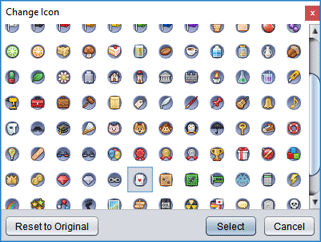

# Generic task

The **Generic** task type can be used to group a set of related files that don't fit any of the existing types. When creating a generic task, you will be prompted to choose a [custom folder icon](um-proj-intro.md#basic-project-file-management) to help distinguish its purpose.

If you have programming experience, you should consider [writing a plug-in](dm-index.md) to register a new task type instead of using a generic task. This gives you the flexibility to define custom task actions to support the specific task.