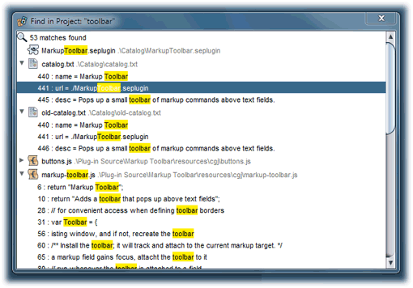

# Find in project

To search all of the files in an open project, enter your search criteria in the search bar located in the middle of the project pane. Advanced search options, such as case sensitivity or the use of regular expressions, can be selected using the search bar's context menu.

A new window will open to list results as they become available. The degree to which a file can be searched depends upon the file type. All files will have their file name matched against the search criteria. Game components and text and source code files will have their contents searched as well. In the latter case, the search hits can be shown line-by-line by clicking the dropdown arrow for the matching text file.

Double click on a file match to open the file. Double click on a line match within a text file to go directly to that line and select the matching text.