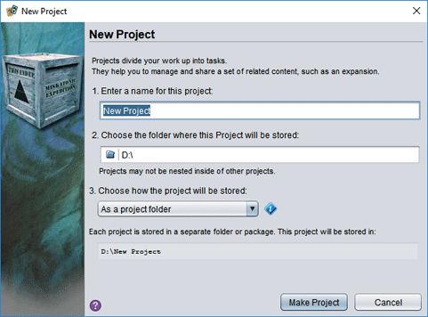
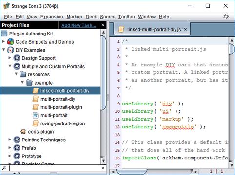
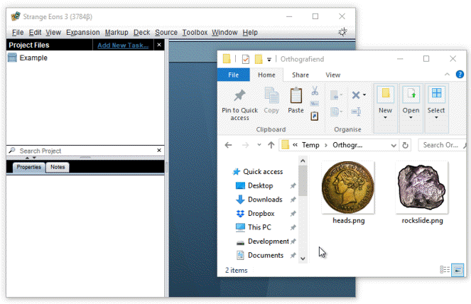

# Projects

If making one card is fun, making a whole deck of cards is a whole deck of a lot of fun, especially if you use a project to organize them. In fact, projects are useful anytime you are working with a group of files in Strange Eons, such as [writing your own plug-in](dm-index.md).

## How they work

A project is just a special folder on your computer. Strange Eons recognizes them because they contain a file named `seproject` that stores the project's settings. You can make any files or folders you like within a project, but the real power of projects comes when you add a *task folder*. Each task folder represents one aspect of your project, such as a single deck of cards. When you create the task folder, you pick the kind of task that best represents what the folder will be used for. When you right click on task folders or their contents, you will get special commands suited to the task you selected.

## Creating a project

To *create a new project*:

1. Choose **File/New Project** from the [main menu](um-menu-bar.md).
2. Enter a name for the project. (This will also be the name of the project folder.)
3. Click the folder icon to choose a location to store the project on your computer, usually in your home or documents folder.
4. Choose how you want to store the project. They are usually stored in folders, as described above.
5. Choose **Make Project**.

Your new, empty, project will be created and then immediately opened.

> **Storing projects in crates (`.seproject` files)**
>
> Instead of storing your project in a folder, you can choose a project package file, or crate. This is essentially a ZIP archive that uses the extension `.seproject`. This can make it more convenient to share, but whenever you open or close the project there will be a delay as the contents  are unpacked or repacked, respectively. You can always convert between the two by right clicking on the project name in Strange Eons and choosing the **Packaging** option.

## The project pane

When you create or open a project, a new pane opens on the left side of the app window. This pane lets you browse all of the files and folders in the project, organize them, and perform file-specific actions.

### Adding tasks

Tasks let you split your project up into manageable pieces. A task is both a kind of design activity and a collection of related files. Each task is stored in a separate folder, called a *task folder*. Files in a task folder may have additional commands specific to the task that are not available when the file is stored elsewhere.

To *add a new task folder*:

1. Click the **Add New Task** link at the top of the project pane. Or, right click the project name and choose **New/Task**.
2. Type a **Name** for the task in the field. (This will also be the name of the task's folder.)
3. Choose the **Task Type** from the list. There are several types to choose from (and plug-ins can add more). Selecting a type in the list will reveal a brief description to help you choose.
4. Choose **Add Task**.
5. Depending on the task type you choose, there may be some additional steps that let you provide more information about the task. You will be guided through the process. Once finished, the new task folder will appear in the project.

> Normally a task folder can only live right inside the project folder. If you move it elsewhere, it loses its special status. If you want to group together some related tasks, you can add a **Task Group** task folder, then move the related tasks inside it by dragging and dropping them.

### Basic project file management

To *view the contents of a folder* click its arrow icon or double click the folder name. Repeat this to hide the folder contents.

To *delete a file or folder*, select it in the project pane, right click, and choose **Delete** (or press <kbd>Delete</kbd>).

To *rename a file or folder*, select it in the project pane, right click, and choose **Rename**.

To *add a folder*, right click on the parent that will contain the new folder and choose **New/Folder**. Then enter the new folder name.

> **Tip:** To create several folders nested inside each other, type the folder names separated by `/` characters. For example, to create the folder structure for the Java package `net.kitty.catpics`, enter the folder name `net/kitty/catpics`.

To *choose a different icon for a task folder*, right click the task folder and choose **Change Icon**, then select the new icon.

To *add a new file*, right click on the folder or task you want to contain the file, then choose **New**, then the file type. For example, you could add a game component to a deck task by right clicking the task folder and choosing **New/Game Component**. Depending on the file type, you may be presented with additional options. After creating the file it will usually be immediately opened for editing.

To *open or edit a file*, double click it in the project pane. If Strange Eons can edit the file directly, it will open it in the document area. If not, it will try to open it using whatever editing tool is assigned to open files of that type by your operating system.

To *copy file(s) into the project*, select the file(s) in your file manager (Explorer, Finder, etc.) then drag and drop it onto the folder in the project pane that you want to add it to. Or, right click and **Copy** the file, then right click the destination folder in the project pane and choose **Paste**.

To *locate a file in your system's file manager*, right click the containing folder and choose **Show Folder**.

To *change the apparent type of a file*, start to **Rename** it. Then click the file extension (such as `.eon`) printed after the name field. The extension will now be added to the name field and you can change it to the extension for the desired file type. This does not convert the actual file from one format to another, it simply changes how Strange Eons treats the file.

To *move files or folders around in the project*, select and drag the files, then drop them onto the folder you want to move them to. Or, select the files, right click, and choose **Cut**, then select the destination folder, right click, and choose **Paste**.