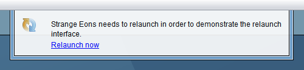

# Relaunching the application

It is sometimes necessary to relaunch (um-quit and restart) Strange Eons to complete a requested operation. Most commonly, relaunches are required after [installing or updating plug-ins](installing-managing-plugins.md) or changing certain [preference settings](preferences.md).

When a relaunch is required, a pop-up message will appear that includes a **Relaunch now** option. Choosing this will cause Strange Eons to relaunch immediately (you will be given an opportunity to save files with unsaved changes first if necessary).

On some platforms, Strange Eons can't restart itself automatically. In this case, after it exits you will need to restart it yourself.

Relaunching is optional, but whatever led to the request will not work correctly until you do it.