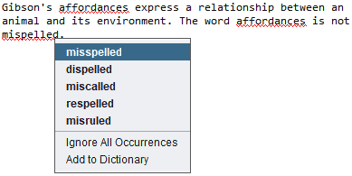
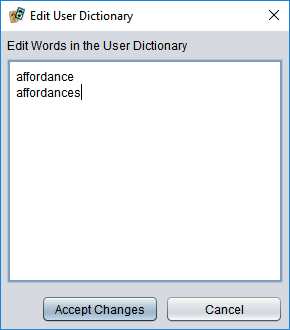

# Spelling checking

Strange Eons can perform live spelling checking on the text that appears on cards. To work, the **Spelling Dictionaries** [core component](um-core-components.md) must be installed, and it must include dictionary support for the current [game language](um-language-settings.md). When available, unknown words will be underlined in red. Right clicking on the word will open a menu of possible replacements and other options.

Choose a replacement for the misspelled word, or choose **Ignore All Occurrences** to stop flagging it for the rest of the session. Choose **Add to Dictionary** to add it to your personal dictionary and stop flagging it permanently.

## Your personal dictionary

You can view or edit the contents of your personal dictionary in **[Preferences](um-preferences.md)**. In the **Language** category, **Spelling** section, choose **Personal Dictionary**. A dialog showing your dictionary words will open. Add, delete, or edit the words, then choose **Accept Changes**.

