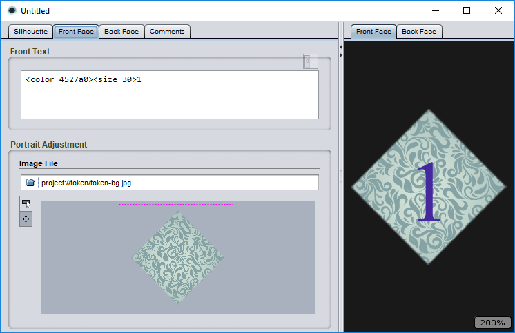

# The marker and token editor

The marker and token editor is built into Strange Eons and does not require any additional plug-ins to use. To design a marker or token, choose **File/New** and in the **Tokens, Markers, or Resources** category, choose **Game Marker or Token**.

## Choosing a silhouette

The first step toward designing your token is to choose a shape, or *silhouette*. The editor comes with a variety of built-in shapes and sizes. In addition, plug-in authors can also [extend the editor with new silhouettes](dm-res-silhouette.md).

To *choose  a silhouette shape*, from the **Silhouette** tab choose a shape from the list. Each entry includes a small image that illustrates the shape and aspect ratio, as well as a description of the shape and its physical size.

To *search for a silhouette shape*, click in the search field just above the list of shapes and start typing. Shapes that do no match will be removed from the list.

To *reset the shape list after a search*, click in the search field just above the list of shapes and erase all of the text (<kbd>Ctrl</kbd>+<kbd>A</kbd>, <kbd>Delete</kbd>).

> If you are planning on cutting your tokens out by hand, triangular or rectangular shapes with unrounded corners are the easiest to cut out. If you would like to make circular shapes with some depth (for example, to cut them out of binder's board), you may wish to invest in a tool called an *arch punch*.

## Designing the marker or token

The token editor lets you cover each face (side) of the token with a graphic and add text or other content. The two faces are worked on separately. In the editor these are called the *front face* and the *back face* in order to distinguish them, but it is up to you to decide which is which. They can be identical if you wish.

To *design one side the marker or token*, click on either the **Front Face** tab or the **Back Face** design tab.

To *choose which side you will preview*, click on either the **Front Face** or **Back Face** tabs in the [preview area](um-gc-preview.md).

To *choose the graphic that covers the face of a token*, use the [portrait panel](um-gc-portraits.md) on that face's design tab.

To *add text and other content over the graphic*, enter [markup text](um-gc-markup.md) in the **Front Text** or **Back Text** field of the face's design tab. By default, the text will be white and will use a default serif font. You can change this using markup tags.

To *insert markup tags* in order to style your text or add other content, you can either type them, use the **Markup** menu, or use the [context bar](um-ui-context-bar.md).