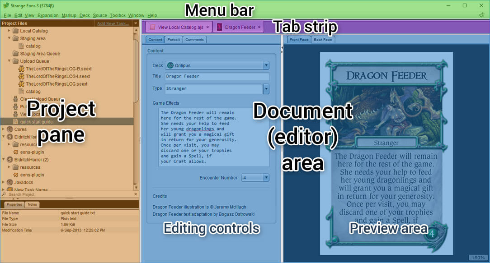

# Overview of the user interface

This page provides a high-level overview of the essential elements of the app's main window. The window can be divided into four areas: the menu bar, the document tab strip, the document area, and the project pane.

The **[menu bar](um-ui-menu.md)**, as with most desktop applications, is used to activate the app's major commands, like printing and saving your work to a file.

The **[tab strip](um-ui-documents.md)** allows you to work on more than one game component or other document at a time and switch between them, like tabs in a Web browser.

The **[document, or editor, area](um-gc-intro.md)** is where the game component or other content that you are currently editing is shown. When you are working on a card or other game component, this is further divided into two vertical strips: a set of editing controls that you can use to change the contents of the card and a preview area that shows you what your changes will look like. The first time you start Strange Eons, there will be no editors open so this area and the tab strip will both be empty.

The **[project pane](um-proj-intro.md)** is only visible when a project is open, so it won't be visible when you first use the app. Projects allow you to organize and work on groups of related files, as well as to write your own plug-ins.

The **[context bar](um-ui-context-bar.md)** is a small tool bar that pops up beside, above, or below other editing controls as you work. It offers easy access to commands that are specific to the control you are using. You can customize the available controls, and plug-in authors can add new ones specially suited to that plug-in's game components or other content.
