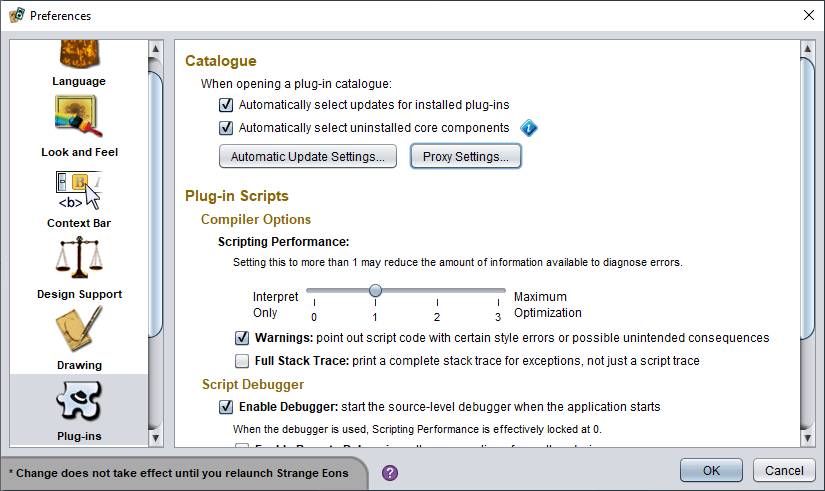

# Preferences

The **Preferences** dialog lets you configure Strange Eons to suit your needs and tastes. The dialog is divided into categories shown in a list running down the side of the dialog. Selecting a category displays the relevant options. To save your changes, choose the **OK** button. Options marked with an asterisk (*) won't take effect until you [relaunch](um-plugins-relaunching.md) the app.

## Categories

The following categories are standard, but plug-ins can add more.

### Language

[Change the game or interface language.](um-install-languages.md) Enable or disable live spelling checking. Configure any installed **Lexical Look-up Services**, such as the [thesaurus](um-gc-thesaurus.md).

### Look and Feel

Change the app theme and other user interface options.

### Context bar

Customize the buttons shown on the [context bar](um-ui-context-bar.md).

### Cloud fonts

The cloud fonts feature gives you access to thousands of free fonts that are downloaded on demand. Both plug-in developers and end users can make use of them. For end users, the cloud fonts preference category lets you explore and select fonts. When you find a font family you want to use, select it in the list and then choose **Reserve**. From now on, this font will be kept downloaded and up to date, and you can use it anywhere that you can specify a font family, such as in a `<family>` markup tag or the the typeface field of generic cards.

### Design support

Options that change how game component editors offer advice on your designs. (Not all game component editors offer design support.)

### Drawing

Adjust how components are drawn. If Strange Eons runs slowly for you, these options may help you improve performance.

### Plug-ins

Settings that affect plug-in behavior and the plug-in catalogue. If you can't download plug-ins or the catalogue because you are behind a proxy, you can configure proxy settings here.

Developers can enable script warnings and the source-level debugger here, and configure the socket port the debugger uses to communicate with the main app.