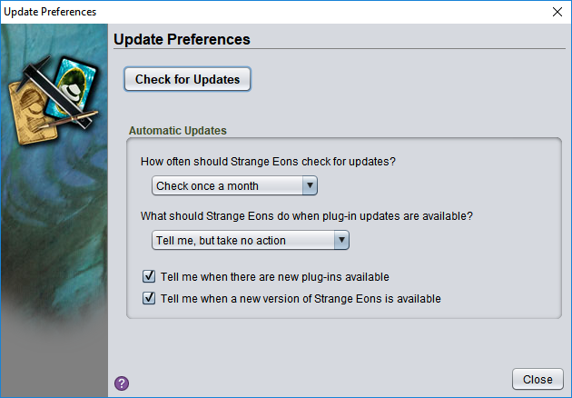

# Managing update notifications

Strange Eons can be set to automatically check for updates, although this feature is initially turned off. To turn it on, choose the **Toolbox/Updates** menu item and select how often you want Strange Eons to check. For most people, once a month is a good choice. When the selected time period has elapsed, Strange Eons will check for updates to your installed plug-ins. It will also check for new plug-ins, and for updates to Strange Eons itself, if those options are checked.

When updates are available, Strange Eons will do one of the following depending on the option you choose:

**Tell me, but take no action**  
A message window will pop up in the corner.

**Install the updates immediately**  
Without fanfare, download and install the updates and then let you know if you need to [relaunch](um-relaunching.md).

## Checking manually

Whether automatic checks are turned on or not, you can choose **Check for Updates** to check for updates at any time.